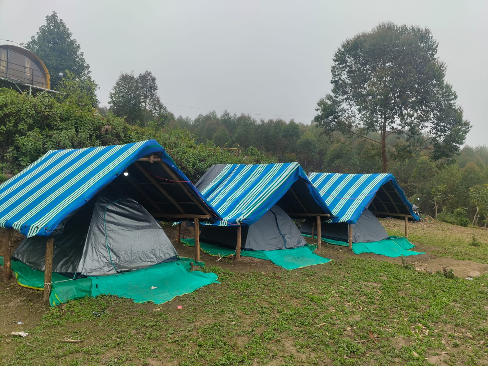

# DREAMPATH DISCOVER

A responsive tourism website for **Dreampath Discover**, offering curated travel experiences, stays, sightseeing packages, and adventure trips across **Tamil Nadu and Kerala**.

The website is built as a **static frontend** using HTML, CSS, and JavaScript, with **Google Apps Script + Google Sheets** used for handling booking, contact, and feedback form submissions.

The project can be opened directly using `index.html` or deployed to GitHub Pages, Netlify, Vercel, or any standard static web host.

---

## 🌄 Project Overview

**Dreampath Discover** provides curated travel experiences across popular destinations in South India.

Current destinations include:

### Tamil Nadu

- Kodaikanal
- Kolukkumalai

### Kerala

- Munnar
- Vattavada
- Kanthaloor

The website allows visitors to:

- Explore destinations
- Browse travel packages
- Compare stay options
- View package details
- Submit booking requests
- Send contact enquiries
- Submit feedback
- Filter trips by state
- Navigate directly to destination-specific packages

---

# ✨ Features

## 🏠 Home Page

The homepage provides:

- Brand introduction
- Featured destinations
- Travel experience highlights
- Call-to-action sections
- Navigation to packages and trips
- Responsive design for mobile, tablet and desktop

---

## 🗺️ Trips Page

The Trips page allows visitors to browse available journeys.

### Filters

- All Journeys
- Tamil Nadu
- Kerala

### Current destinations

- Kolukkumalai
- Kodaikanal
- Kodaikanal Complete Stay
- Vattavada
- Kanthaloor
- Munnar

Each trip card provides:

- Destination
- Duration
- Starting price
- Short description
- Destination image
- Direct navigation to the relevant package page

---

# 🏕️ Tour Packages

The Tour Packages page provides an overview of the major destinations and allows users to open their detailed package pages.

Current package categories include:

### Kolukkumalai

- Twilight Tents
- Glass Castle
- Logwood Cabin

### Kodaikanal

- Perumalai Mist Cabin
- Pannaikadu Stone House
- Pannaikadu Log House
- Poombarai Twilight Tent
- Poombarai Yellow A-Frame
- Kodaikanal Complete Stay

### Vattavada

- Sky Tent
- Mud Hut Stay
- Cocoon Stay Mist
- Tree House

### Kanthaloor

- Tent Stay
- A-Frame Stay
- Complete adventure experiences

### Munnar

- Premium Hill View Room Stay
- Kanthaloor Hidden Paradise
- Munnar Glamping Getaway
- Munnar 3 Days / 2 Nights Package

---

# 📍 Destination Pages

The website includes dedicated pages for individual destinations and packages.

Examples include:

```text
kolukumalai-trip.html
kodaikannal.html
kodailkanal-complete.html
vattavada.html
Kanthaloor.html
munnar.html
```

Each destination page can contain:

- Accommodation details
- Package duration
- Pricing
- Day-by-day itinerary
- Package inclusions
- Package exclusions
- Facilities
- Pickup/drop information
- Booking button
- Responsive destination images

---

# 🏨 Munnar Packages

The Munnar page contains multiple package options.

### Premium Hill View Room Stay

- 2 Nights Stay
- Hill View
- Meals
- Sightseeing
- Pickup & Drop

### Kanthaloor Hidden Paradise

- Jeep Safari
- Tent Stay
- Trekking
- Waterfalls
- Campfire

### Munnar Glamping Getaway

- Glamping
- Jeep Safari
- Waterfalls
- Campfire
- DJ Music

### Munnar 3 Days / 2 Nights

- 2 Nights
- Glamping
- Jeep Safari
- Swimming Pool
- Adventure Activities

---

# ⛰️ Vattavada Packages

The Vattavada page provides four unique stay experiences.

### Sky Tent

- Sky Tent
- Meals
- Waterfall Fun
- Campfire
- Viewpoint Trekking

### Mud Hut Stay

- Mud Hut
- Meals
- Waterfall Fun
- Campfire
- Viewpoint Trekking

### Cocoon Stay Mist

- Cocoon Stay
- Meals
- Waterfall Fun
- Campfire
- Viewpoint Trekking

### Tree House

- Tree House
- Meals
- Waterfall Fun
- Campfire
- Viewpoint Trekking

---

# 📱 Responsive Design

The website is designed to work across:

- Desktop
- Laptop
- Tablet
- Mobile phones

Responsive layouts include:

- Mobile navigation
- Responsive package grids
- Responsive destination cards
- Flexible typography
- Mobile-friendly booking forms
- Responsive images
- Touch-friendly buttons

---

# 🎨 Design

The website uses a premium travel-inspired visual style.

### Fonts

- DM Sans
- Playfair Display

### Design elements

- Glassmorphism navigation
- Editorial-style typography
- Large destination imagery
- Minimal card layouts
- Responsive grids
- Soft neutral backgrounds
- Premium travel aesthetic
- Smooth hover interactions

---

# 📂 Project Structure

```text
dreampath-discover/
│
├── index.html
├── trips.html
├── tour-packages.html
├── about.html
├── contact.html
├── feedback.html
│
├── kolukumalai-trip.html
├── kodaikannal.html
├── kodailkanal-complete.html
├── vattavada.html
├── Kanthaloor.html
├── munnar.html
│
├── css/
│   └── style.css
│
├── js/
│   ├── script.js
│   └── google-sheet.js
│
├── images/
│   ├── kolukumalai/
│   ├── kodaikanal/
│   ├── vattavada/
│   ├── kanthaloor/
│   ├── munnar/
│   └── ...
│
├── appscript/
│   └── Code.gs
│
└── README.md
```

---

# 📸 Images

Destination images are stored inside the `images` directory.

Example:

```text
images/
├── kolukumalai/
│   ├── twilight-tents/
│   ├── glass-castle/
│   └── logwood-cabin/
│
├── kodaikanal/
│   ├── perumalai-mist-cabin/
│   ├── pannaikadu-stone-house/
│   ├── pannaikadu-log-house/
│   ├── poombarai-twilight-tent/
│   └── poombarai-yellow-a-frame/
│
├── vattavada/
│   ├── sky-tent/
│   ├── mud-hut/
│   ├── cocoon/
│   └── tree-house/
│
├── kanthaloor/
│
└── munnar/
```

Use **relative paths** for all website images.

For example:

```html

```

Do **not** use Windows-specific paths such as:

```text
C:\Users\haris\Documents\...
```

Relative paths ensure that images work correctly after deployment.

---

# 📊 Google Sheets Integration

Dreampath Discover uses **Google Apps Script** to send form submissions to Google Sheets.

The following forms are supported:

- Booking
- Contact
- Feedback

---

# 📋 Google Sheet Setup

Create a Google Sheet.

Create these three tabs exactly:

```text
Bookings
Contacts
Feedback
```

The Apps Script uses these sheet names when storing submissions.

---

# ⚙️ Google Apps Script Setup

Open the Google Sheet.

Go to:

```text
Extensions → Apps Script
```

Replace the Apps Script contents with:

```text
appscript/Code.gs
```

Set your Google Sheet ID inside:

```javascript
const SPREADSHEET_ID = '';
```

The Spreadsheet ID is the value between:

```text
/d/
```

and:

```text
/edit
```

in your Google Sheets URL.

Example:

```text
https://docs.google.com/spreadsheets/d/YOUR_SHEET_ID/edit
```

---

# 🚀 Deploy Google Apps Script

Inside Google Apps Script:

```text
Deploy
    ↓
New deployment
    ↓
Web app
```

Configure:

### Execute as

```text
Me
```

### Who has access

```text
Anyone
```

Authorize the deployment.

Copy the generated Web App URL.

---

# 🔗 Connect Website to Google Apps Script

Open:

```text
js/script.js
```

Find:

```javascript
const APPS_SCRIPT_URL = '';
```

Paste your Google Apps Script Web App URL:

```javascript
const APPS_SCRIPT_URL = 'YOUR_GOOGLE_APPS_SCRIPT_WEB_APP_URL';
```

Save the file.

---

# 🧪 Test Forms

After connecting Google Apps Script:

1. Open the website.
2. Submit a booking request.
3. Check the `Bookings` sheet.
4. Submit the contact form.
5. Check the `Contacts` sheet.
6. Submit feedback.
7. Check the `Feedback` sheet.

Each submission should create a new row.

---

# 📝 Form Handling

The frontend JavaScript handles:

- Form validation
- Booking modal
- Booking package selection
- Contact form submission
- Feedback submission
- Success messages
- Error messages
- Google Apps Script communication

The booking buttons use the package name through:

```html
data-trip="Package Name"
```

Example:

```html
<button
  class="btn btn-primary js-book"
  data-trip="Vattavada – Sky Tent"
>
  Book this stay
</button>
```

This allows the selected package to automatically appear in the booking form.

---

# 🔐 Privacy & Security

The website is a static frontend, but it collects customer information through forms.

Before public launch, add:

- Privacy Policy
- Terms & Conditions
- Cancellation Policy
- Booking Terms
- Refund Policy
- Data handling information

Do not expose sensitive information inside frontend JavaScript.

---

# 💰 Package Pricing

Package pricing currently displayed on the website is for demonstration/business use and should be reviewed before launch.

Before publishing:

- Verify all prices
- Verify seasonal pricing
- Verify group pricing
- Verify inclusions
- Verify exclusions
- Verify pickup/drop charges
- Verify activity charges
- Verify accommodation availability

Make sure the website pricing matches the actual business pricing.

---

# 📞 Business Information

Before launch, replace all placeholder business information.

Update:

```text
Phone number
WhatsApp number
Email address
Business address
Social media links
Google Maps location
```

Check these locations:

```text
js/script.js
contact.html
index.html
footer
```

---

# 🌐 Deployment

Because Dreampath Discover is a static website, no traditional backend server is required.

It can be deployed using:

### GitHub Pages

Push the project to a GitHub repository and enable GitHub Pages.

### Netlify

Upload or connect the project repository.

### Vercel

Import the GitHub repository and deploy it as a static site.

### Traditional Hosting

Upload the complete project folder to the hosting server.

---

# 💻 Local Development

No framework or build process is required.

You can simply open:

```text
index.html
```

in a browser.

For a better local development experience, use VS Code with Live Server.

Example project URL:

```text
http://127.0.0.1:5500/
```

---

# 🐳 Docker

The project can also be hosted using Docker with a lightweight static web server.

Example architecture:

```text
Browser
   │
   ▼
Docker
   │
   ▼
Nginx
   │
   ▼
Dreampath Discover Static Files
```

The website does not require Node.js, Java, Spring Boot, MySQL, or another application server for the frontend.

---

# 🧰 Technologies Used

### Frontend

- HTML5
- CSS3
- JavaScript
- Responsive Web Design

### Fonts

- DM Sans
- Playfair Display

### Forms / Backend Service

- Google Apps Script
- Google Sheets

### Hosting

Compatible with:

- GitHub Pages
- Netlify
- Vercel
- Nginx
- Apache
- Standard static hosting

---

# 🔄 Website Flow

```text
                    DREAMPATH DISCOVER
                           │
             ┌─────────────┴─────────────┐
             │                           │
           Trips                    Tour Packages
             │                           │
      ┌──────┴──────┐             ┌──────┴──────┐
      │             │             │             │
 Tamil Nadu       Kerala      Destinations   Packages
      │             │             │             │
      ▼             ▼             ▼             ▼
 Kodaikanal     Munnar       Vattavada     Stay Options
 Kolukkumalai   Vattavada    Kanthaloor    Itineraries
                Kanthaloor   Kodaikanal    Pricing
                             Kolukkumalai  Booking
                             Munnar
                                   │
                                   ▼
                              Booking Form
                                   │
                                   ▼
                           Google Apps Script
                                   │
                                   ▼
                              Google Sheets
```

---

# 📌 Pre-Launch Checklist

Before publishing the website, verify:

### Website

- [ ] All pages load correctly
- [ ] Navigation links work
- [ ] Mobile navigation works
- [ ] All destination links work
- [ ] All booking buttons work
- [ ] Booking modal works
- [ ] Contact form works
- [ ] Feedback form works

### Images

- [ ] All images load
- [ ] No `C:\Users\...` paths remain
- [ ] Image filenames are correct
- [ ] Images are properly compressed
- [ ] You have permission/licensing for all images

### Packages

- [ ] Prices verified
- [ ] Seasonal prices verified
- [ ] Group prices verified
- [ ] Inclusions verified
- [ ] Exclusions verified
- [ ] Itineraries verified
- [ ] Pickup/drop information verified

### Google Sheets

- [ ] `Bookings` tab exists
- [ ] `Contacts` tab exists
- [ ] `Feedback` tab exists
- [ ] Apps Script deployed
- [ ] Web App URL added to `script.js`
- [ ] Booking test completed
- [ ] Contact test completed
- [ ] Feedback test completed

### Business

- [ ] Phone number updated
- [ ] WhatsApp number updated
- [ ] Email updated
- [ ] Address updated
- [ ] Social media links updated
- [ ] Google Maps link updated

### Legal

- [ ] Privacy Policy added
- [ ] Terms & Conditions added
- [ ] Cancellation Policy added
- [ ] Refund Policy added

---

# 🚀 Future Improvements

Possible future features include:

- Online payment integration
- WhatsApp booking integration
- Google Maps integration
- Customer reviews
- Destination search
- Advanced package filtering
- Seasonal pricing
- Availability calendar
- Image galleries
- Admin dashboard
- Booking management system
- Automated booking confirmation emails
- Automated WhatsApp notifications
- Customer enquiry notifications

---

# 📄 License

This project is developed for **Dreampath Discover**.

All business content, branding, package information, logos, photographs and other proprietary materials belong to their respective owners.

Do not reuse business-specific content or images without permission.

---

# 🌿 Dreampath Discover

**Discover the journey. Create the memory.**

Explore the hills, forests, waterfalls, villages and hidden escapes of South India with Dreampath Discover.